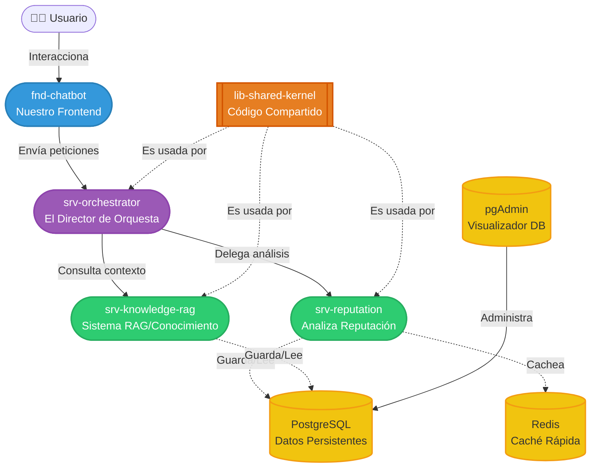
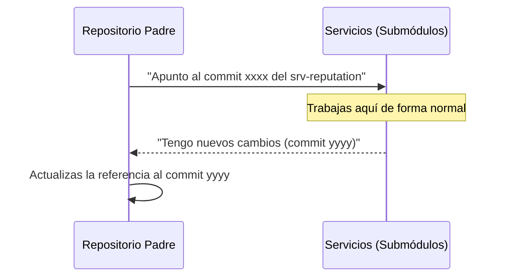

# 🚀 Guía de nuestra Arquitectura

¡Hola equipo! 👋 Si estás viendo esto es porque te toca meter mano al código.

Hemos montado el proyecto dividiéndolo en piezas más pequeñas (Microservicios) para que podamos trabajar sin pisarnos unos a otros. En lugar de tener un "monolito" gigante donde cambiar un texto rompe la base de datos, aquí cada pieza vive en su propio mini-mundo.

---

## 🏗️ La Foto General (Nuestra Arquitectura)

Aquí tienes la vista de pájaro de cómo encajan las piezas. 



### 🧩 ¿Qué hace cada cosa?

- **`fnd-chatbot` (Frontend)**: La cara bonita. Lo que el usuario usa para hablar y enviar enlaces.
- **`srv-orchestrator` (Orquestador)**: El jefe. Recibe lo que dice el frontend y decide a quién llamar (reputación o conocimiento) para devolver una respuesta coherente.
- **`srv-reputation` (Servicio de Reputación)**: El detective. Se encarga de mirar si un enlace es sospechoso (Phishing) o no.
- **`srv-knowledge-rag` (Servicio RAG)**: El cerebrito. Busca información en la base de datos vectorizada para dar respuestas basándose en documentos.
- **`lib-shared-kernel` (Librería)**: Es la "caja de herramientas" compartida. Contiene código, funciones y modelos comunes que todos los servicios necesitan. ¡Así no repetimos código!
- **`Infraestructura`**: Un PostgreSQL (base de datos), un Redis (para chivatazos rápidos/caché) y pgAdmin (para ver la base de datos sin comandos raros).

---

## 🔗 Los "Git Submodules" (O por qué el repo parece vacío)

Para mantener cada microservicio independiente, usamos **Git Submodules**. Básicamente, este repositorio "padre" no guarda el código de los servicios... **¡solo guarda links a otros repositorios!** 

Esto nos permite que si trabajas en el Chatbot, te evites enterarte del código de la base de datos. 



### 🛠️ Flujo de trabajo: "¿Cómo programo y actualizo esto sin romper nada?"

#### 1. Clonar el proyecto completo (la primera vez)
Como no son carpetas normales, para clonar y bajarte todo el código de golpe asegúrate de usar `--recurse-submodules`:
```bash
git clone --recurse-submodules <url-del-repo-padre>
```

#### 2. Desarrollando (Día a día)
Para programar, entras a la carpeta del servicio (ej. `cd services/srv-reputation`), **creas tu rama**, trabajas y haces tus `commit` y `push` como siempre. Funciona como un repositorio normal y corriente.

#### 3. Actualizar tu Repo Padre con cambios de otros
Si tu compañero actualizó algo y necesitas bajártelo a tu ordenador:
```bash
# Estando en la carpeta raíz del proyecto padre:
git pull origin main
git submodule update --init --recursive
```
*(Esto lee los links del repo padre y descarga el código exacto de cada submódulo).*

#### 4. Actualizar las referencias (¡Importante!)
Si tú o alguien ha subido código a un servicio y quieres que este repositorio padre "se entere" de que hay una versión más nueva:

```bash
# Comando mágico que actualiza todas las carpetas a la última versión remota
git submodule update --remote

# Luego, en el repo padre, tienes que hacer un commit para guardar que las referencias cambiaron:
git add .
git commit -m "build: actualizar referencias de submodulos"
git push
```

---

## ⚙️ Estrategia CI/CD (Integración y Despliegue)

Nuestra estrategia busca automatizar lo aburrido para que tú te dediques a pensar. 

```mermaid
flowchart LR
    Dev((Tú)):::frontend
    Code[Escribes Código]
    PR{Pull Request}
    CI[Verificación Automática\n(Tests, Lint)]
    Merge{Merge a main}
    CD[Construye Imagen\ny Pushea a Registry]

    Dev --> Code
    Code -->|Creas PR| PR
    PR -->|Acciona| CI
    CI -->|Pasa en Verde!| Merge
    Merge -->|Acciona| CD
```

Nos apoyamos en GitHub Actions en cada repositorio individual:
1. **Pull Request Check (`ci-pr-check.yml`)**: Cada vez que creas una PR, una maquinita ejecuta los tests automáticos y revisa que el código esté limpio. Nadie mezcla código a la rama principal (main) si esto está en rojo. 🛑
2. **Build & Push (`build-push.yml`)**: Cuando los cambios son aceptados y llegan a `main`, automáticamente se empaqueta tu código en un contenedor Docker y se prepara para ser desplegado. 🐳

### 🏆 Resumen de super-vivencia
1. **Tu código de servicio vive en su propio repo**. Haz tus ramas ahí.
2. Si creas cambios que afectan a varios sitios (ej: compartes una herramienta nueva en el `lib-shared-kernel`), actualiza la librería y **luego** actualiza el `srv-orchestrator` para que empiece a usar la nueva versión.
3. Actualiza el repo padre (`git submodule update --remote`) periódicamente para garantizar que toda la orquesta suena bajo la misma partitura.

¡Ya estás listo para romper... digo, para programar! 💻🚀
